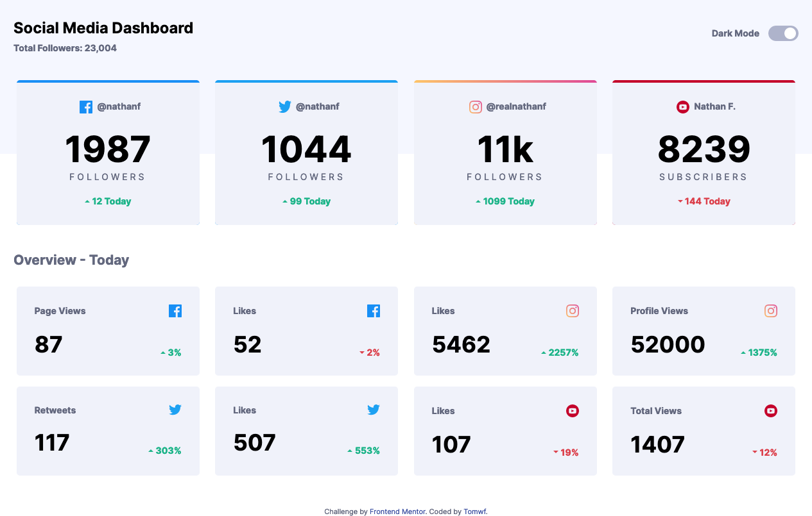
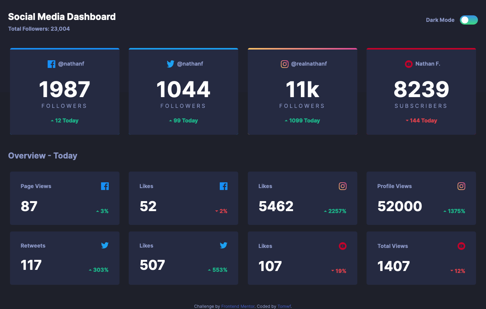
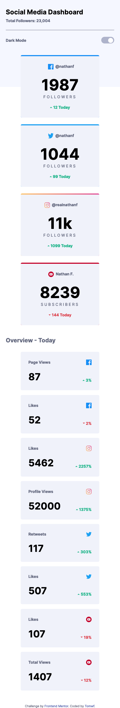

# Frontend Mentor - Social media dashboard with theme switcher solution

This is a solution to the [Social media dashboard with theme switcher challenge on Frontend Mentor](https://www.frontendmentor.io/challenges/social-media-dashboard-with-theme-switcher-6oY8ozp_H). Frontend Mentor challenges help you improve your coding skills by building realistic projects. 

## Table of contents

- [Overview](#overview)
  - [The challenge](#the-challenge)
  - [Screenshot](#screenshot)
  - [Links](#links)
- [My process](#my-process)
  - [Built with](#built-with)
  - [What I learned](#what-i-learned)
  - [Useful resources](#useful-resource)

## Overview

### The challenge

Users should be able to:

- View the optimal layout for the site depending on their device's screen size
- See hover states for all interactive elements on the page
- Toggle color theme to their preference

### Screenshot

#### Desktop Version - Light Theme

#### Desktop Version - Dark Theme

#### Mobile Version - Light Theme

#### Mobile Version - Dark Theme

### Links

- Live Site URL: [Social media dashboard with theme switcher](https://fem-social-media-dashboard-with-theme-switcher-master.vercel.app/)

## My process

### Built with

- Semantic HTML5 markup
- Flexbox
- Mobile-first workflow
- [Next.js](https://nextjs.org/) - React framework
- [Styled Components](https://styled-components.com/) - For styles

### What I learned

- Nextjs
- Styled components
- Context API

### Useful resources

#### Videos
- [Learn useContext In 13 Minutes  (Web Dev Simplified)](https://www.youtube.com/watch?v=5LrDIWkK_Bc) - This amazing video helped me to understand how to avoid prop-drilling using Context API.
- [Styled Components Crash Course & Project (Traversy Media)](https://www.youtube.com/watch?v=02zO0hZmwnw) - This amazing video helped me to understand how to style the website using styled components.

#### Blogs
- [How To Use Themes with styled-components (Jacob D. Castro)](https://jacobdcastro.com/tutorials/how-to-use-themes-with-styled-components) - This article helped me understand how to use themes.

#### Errors
- [Warning: Prop className did not match. #7322 (GitHub)](https://github.com/vercel/next.js/issues/7322) - I freaked out after merging a branch to master where all my styles are gone. The solution is to delete `.next` folder and restart `npm run dev`.
